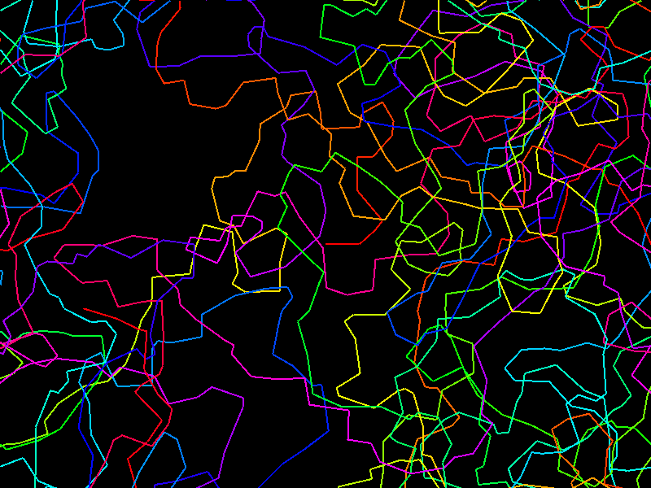

# Doodle Generator - F# and Python Implementations



## Overview
This project features two implementations of a doodle generator:
1. **F# Implementation** (`Program.fs`):
   - Uses a custom `MyTurtle` class that mimics Python's Turtle Graphics
   - Generates doodles by executing random movements
   - Saves output as `doodle.png`
   - Allows specifying number of iterations (default: 1000)

2. **Python Implementation** (`doodle_gen.py`):
   - Uses Python's built-in Turtle Graphics module
   - Runs for exactly 5 minutes (300 seconds) with real-time visualization
   - Features screen wrapping boundary logic
   - Shows vibrant color transitions using HSV colorspace

Both implementations create generative art with similar characteristics but different execution approaches.

## Prerequisites
- **F# Version**:
  - .NET SDK 8.0+
  - Windows OS (graphics dependencies)
  
- **Python Version**:
  - Python 3.10+
  - `turtle` standard library module

## Installation & Execution
```bash
git clone https://github.com/Pac-Dessert1436/Doodle-Generator.git
cd Doodle-Generator
```

### F# Version
```bash
dotnet restore
dotnet build
dotnet run
```

### Python Version
```bash
python doodle_gen.py
```

## Key Implementation Details
### F# Implementation
- **Custom Turtle Graphics**:
  - `MyTurtle` class handles drawing operations
  - Maintains position, heading, and color state
  - Uses GDI+ for graphics rendering
- **Color Handling**:
  - `colorFromHsv` function converts HSV to RGB
  - Hue increments by 0.005 per iteration
- **Output**:
  - Saves generated doodle to `doodle.png`
  - Console feedback during execution

### Python Implementation
- **Standard Turtle Module**:
  - Uses built-in turtle graphics
  - Real-time visualization
- **Boundary Handling**:
  - Wraps turtle position when it reaches screen edges
- **Execution**:
  - Runs for exactly 5 minutes (300 seconds)
  - Automatic color progression

## Contributing
Contributions are welcome! Please open an issue first to discuss proposed changes.

## License
MIT License - see [LICENSE](LICENSE) for details.